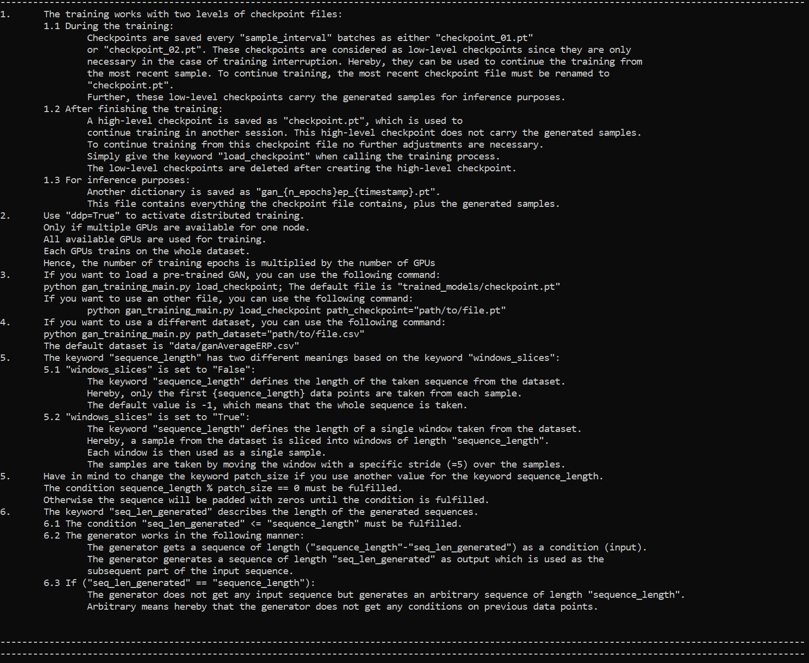

---
hide:
    -toc
---
# GAN Package Main Functions

## <b>GAN Package Details</b>
<b>There are three main scripts from the GANs package: </b><br>
&emsp;&emsp;```gan_training_main.py``` - This trains a GAN <br>
&emsp;&emsp;```visualize_main.py``` - This trains a GAN <br>
&emsp;&emsp;```generate_samples_main.py``` - This generates synthetic samples using the trained GAN

<b>Arguments for these files are stated after the script filename, for example:</b><br>
&emsp;&emsp;```python gan_training_main.py n_epochs=100```

<b>For the files in this package, you can use the help argument to see a list of possible arguments with a brief description:</b><br>
&emsp;&emsp;```python gan_training_main.py help```

<details style="border-color:Grey;">
    <summary style="background-color:transparent;"><b><font size = "4">GAN Training Help</font></b></summary>
    <font size = "3">
&emsp;&emsp;<code>python gan_training_main.py help</code><br>
<br>
<br>
<br>
</details>

<details style="border-color:Grey;">
    <summary style="background-color:transparent;"><b><font size = "4">Visualize Help</font></b></summary>
    <font size = "3">
&emsp;&emsp;<code>python visualize_main.py help</code><br>
<br>
<br>
<br>
</details>

<details style="border-color:Grey;">
    <summary style="background-color:transparent;"><b><font size = "4">Generate Samples Help</font></b></summary>
    <font size = "3">
&emsp;&emsp;<code>python generate_samples_main.py help</code><br>
<br>
<br>

</details>