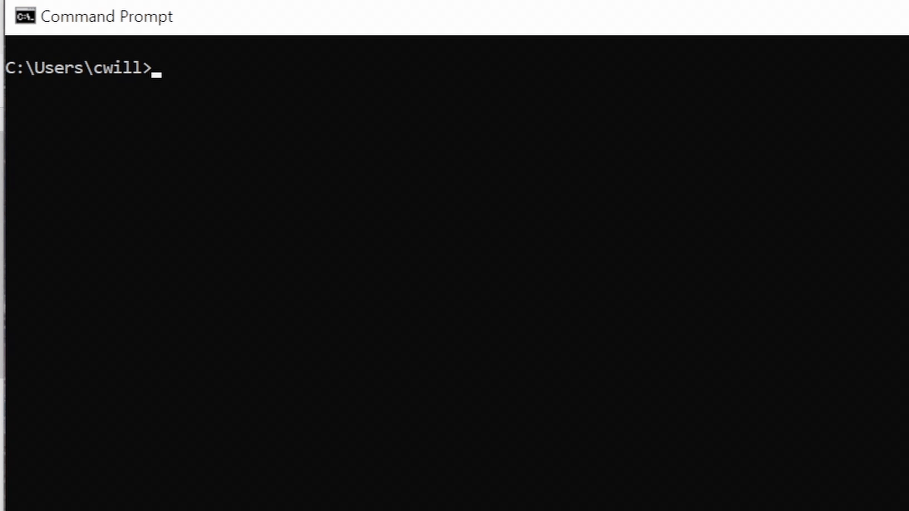
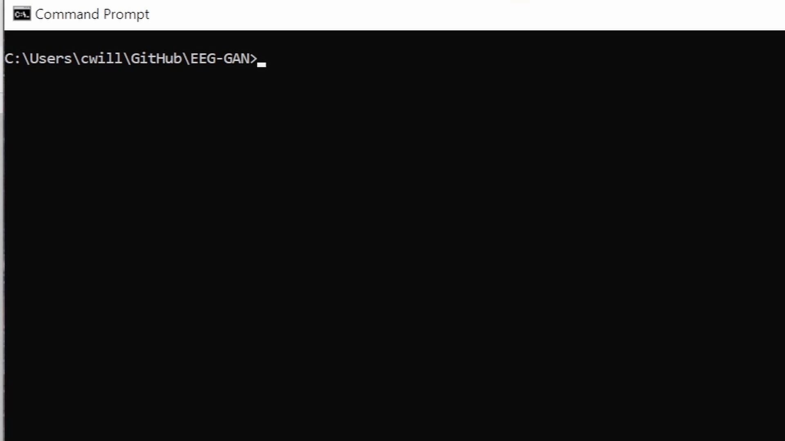
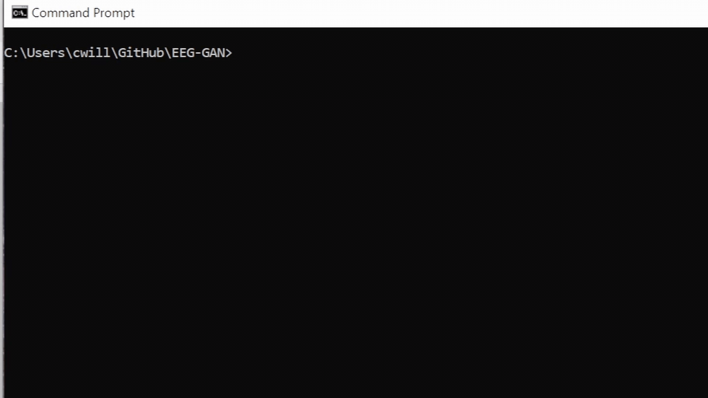
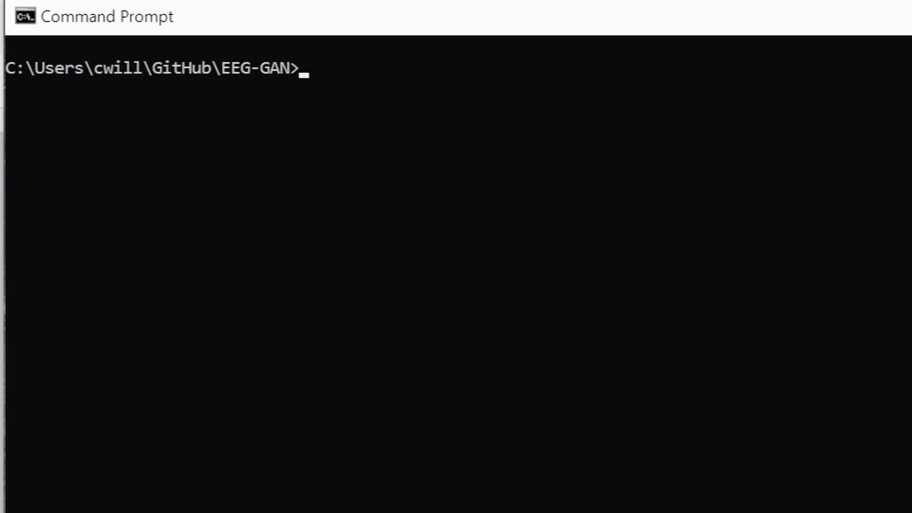
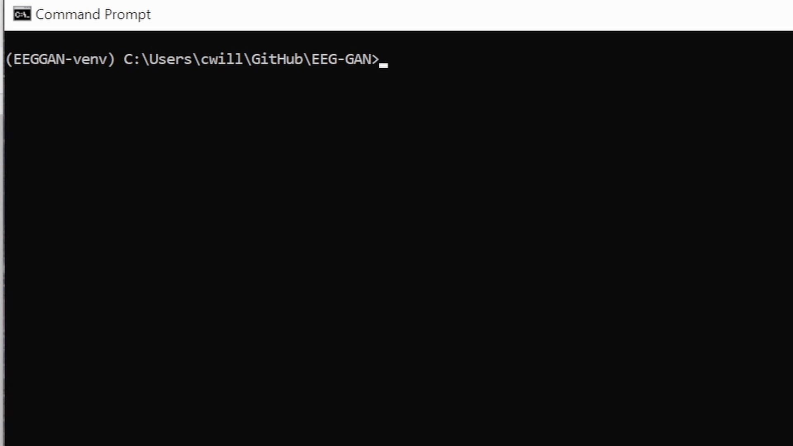

---
hide:
    -toc
---
# Getting Started

## <b> Pre-Requirements: </b>

1. [Python](https://www.python.org/downloads/)
2. [Pip](https://pip.pypa.io/en/stable/installation/)
3. [Git](https://git-scm.com/book/en/v2/Getting-Started-Installing-Git)
4. [Python Virtual Environment](https://virtualenv.pypa.io/en/latest/installation.html)


## <b> Setting Up the Package: </b>

1. <b> Open your terminal </b><br>
    ```Named Terminal on Macs and Command Line in Windows/Linux```<br>
    {: style="height:360px;width:640px"}
2. <b> Navigate to the desired directory, for example:</b><br>
    ```cd GitHub/gansEEG```<br>
    {: style="height:360px;width:640px"}
3. <b> Clone the GAN package repository:</b><br>
    ```git clone https://github.com/AutoResearch/GAN-in-Neuro.git```<br>
    {: style="height:360px;width:640px"}
4. <b> Create a virtual environment:</b><br>
    ```python -m venv EEGGAN-venv```<br>
    {: style="height:360px;width:640px"}
5. <b> Activate the environment</b><br>
    <b> For Windows:</b> ```EEGGAN-venv\Scripts\activate``` <br>
    <b> For Mac/Linux:</b> ```source EEGGAN-venv/bin/activate```<br>
    {: style="height:360px;width:640px"}
6. <b> Install dependencies </b> <br>
    ```pip install -r GAN-in-Neuro/requirements.txt```<br>
    {: style="height:360px;width:640px"}

[You are now ready to use the package!]('functions.md')