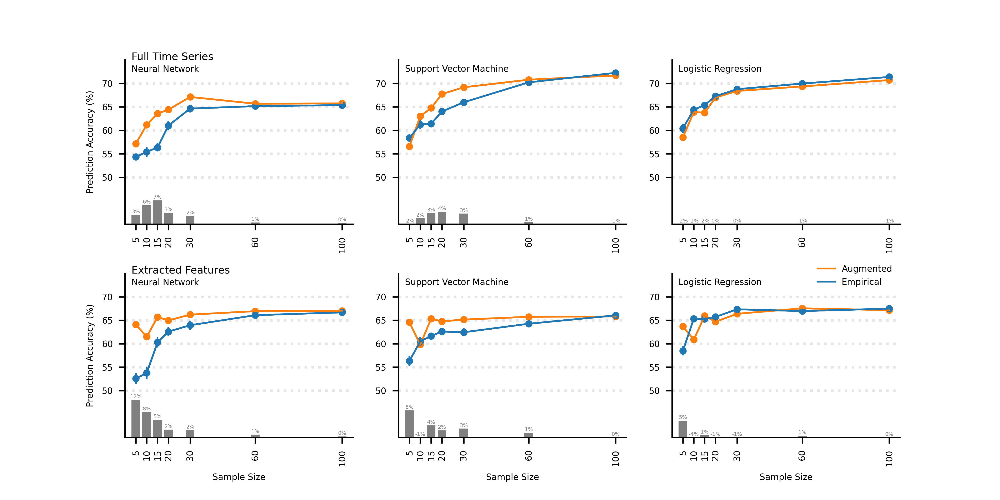

---
hide:
    -toc
---

# Research

## <b>Augmenting EEG with Generative Adversarial Networks Enhances Brain Decoding Across Classifiers and Sample Sizes</b>
### <i>Williams, Weinhardt, Wirzberger, & Musslick (in press), Proceedings of the Annual Meeting of the Cognitive Science Society</i>

 [Preprint](https://osf.io){ .md-button } [Journal Print](https://cognitivesciencesociety.org/cognitive-science-journal/){ .md-button} [Data and Scripts](https://github.com/chadcwilliams/EEG-GAN_CognitiveScience2023){ .md-button } 

#### <i>Abstract:</i> ####

There is major potential for using electroencephalography (EEG) in brain decoding that has been untapped due to the need for large amounts of data. Advances in machine learning have mitigated this need through data augmentation techniques, such as Generative Adversarial Networks (GANs). Here, we gauged the extent to which GANs can augment EEG data to enhance classification performance. Our objectives were to determine which classifiers benefit from GAN-augmented
EEG and to estimate the impact of sample sizes on GAN-enhancements. We investigated three classifiers—neural networks, support vector machines, and logistic regressions—
across seven sample sizes ranging from 5 to 100 participants. GAN-augmented EEG enhanced classification for neural networks and support vector machines, but not logistic regressions. Further, GAN-enhancements diminished as sample sizes increased—suggesting it is most effective with small samples, which may facilitate research that is unable to collect large amounts of data.

{: style="height:600px;width:1200px"}