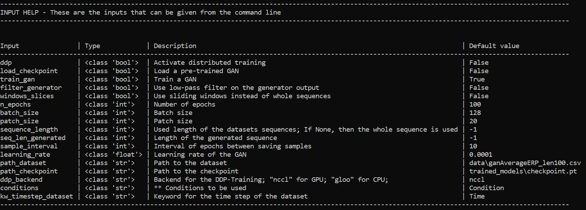
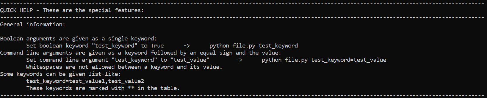

---
hide:
    -toc
---
# GAN Package Main Functions

## <b>GAN Package Details</b>
<b>There are two main scripts from the GANs package: </b><br>
&emsp;&emsp;```gan_training_main.py``` - This trains a GAN <br>
&emsp;&emsp;```generate_samples_main.py``` - This generates synthetic samples using the trained GAN

<b>Arguments for these files are stated after the script filename, for example:</b><br>
&emsp;&emsp;```python gan_training_main.py n_epochs=100```

<b>For the files in this package, you can use the help argument to see a list of possible arguments with a brief description:</b><br>
&emsp;&emsp;```python gan_training_main.py help```

---

## <b>GAN Training Help</b>

&emsp;&emsp;```python gan_training_main.py help```



---

## <b>Generate Samples Help</b>

&emsp;&emsp;```python generate_samples_main.py help```


